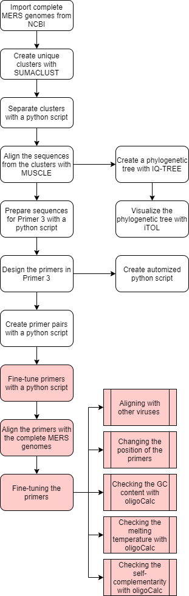

# Introduction 
* Made by Nynke van Eijk en Giulia Kleijwegt
* Made in May 2020
* Title project: Primer design for nanopore MinION sequencing of MERS-CoV

# Goal
The goal of our minor project was to develop primers for the Middle East Resperatory Syndrome Corona Virus. These primers are designed using bioinformatics.

# Flowchart
The flowchart can be seen in figure 1. It shows step by step which tools were used to design the primers. The red indicates which steps have not been carried out, but are recommended to be carried out.

Figure 1. Flowchart of the project.



# Python script [python script](NAME SCRIPT)
The attached python script was used to run the tools. All tools and actions used are combined in a python script and can therefore be started automatically. In order to use this script and the tool, certain programs must be downloaded. These are described under the chapter Installation. The script itself indicates which part of the script is intended for what. The variables at the top of the script are also indicated separately and can therefore be easily adapted to your wishes.

# Installation 
This describes the installation and use of the tools.

###### Fetch FASTA files
```
sudo apt install ncbi-entrez-direct
```
###### Usage 
```
esearch -db nucleotide -query "txid1335626[Organism]"| efilter -query "complete genome"| efilter -query "27000:35000[Sequence length]| efetch -format fasta > mers_cov.fasta
```
###### SUMACLUST
```
wget https://git.metabarcoding.org/obitools/sumaclust/uploads/69f757c42f2cd45212c587e87c75a00f/sumaclust_v1.0.20.tar.gz  
tar -zxvf sumaclust_v1.0.20.tar.gz
cd sumaclust_v1.0.20
make
```
###### Usage
```
sumaclust -t 0.97 input.fasta > output.fasta
```
###### MUSCLE
```
wget https://www.drive5.com/muscle/downloads3.8.31/muscle3.8.31_i86linux64.tar.gz 
tar -zxvf muscle3.8.31_i86linux64.tar.gz
mv muscle3.8.31_i86linux64 muscle
```
###### Usage
```
muscle -in input.fasta -out output.afa -maxiters 2 -diags
```
###### Primer 3
```
sudo apt-get install -y build-essential g++ cmake git-all
git clone https://github.com/primer3-org/primer3.git primer3
cd primer3/src
make
make test
```
###### Usage
```
primer3_core input.afa
<or>
primer3_core --format_output --output=directory/output_name.txt input_file.txt
```
###### Biopython
```
wget http://biopython.org/Dist/biopython-1.76.tar.gz 
tar -zxvf biopython-1.76.tar.gz
pip install biopython
```
###### Usage
```
import Bio
```
